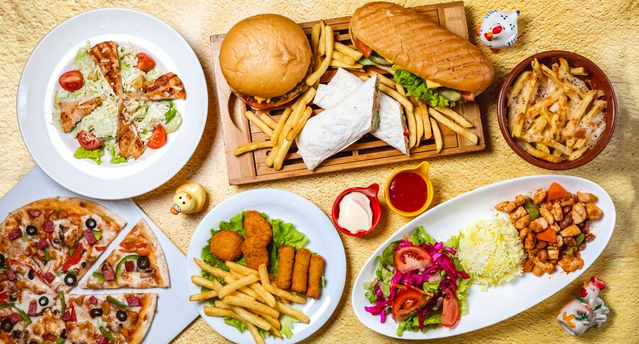

<!doctype html>
<html lang="en">
  <head>
    <meta charset="utf-8">
    <meta name="viewport" content="width=device-width, initial-scale=1">
    <title></title>
    <link href="https://cdn.jsdelivr.net/npm/bootstrap@5.3.2/dist/css/bootstrap.min.css" rel="stylesheet" integrity="sha384-T3c6CoIi6uLrA9TneNEoa7RxnatzjcDSCmG1MXxSR1GAsXEV/Dwwykc2MPK8M2HN" crossorigin="anonymous">
    <link rel="stylesheet" href="https://cdnjs.cloudflare.com/ajax/libs/font-awesome/5.15.3/css/all.min.css">
    <link rel="stylesheet" type="text/css"href="css/style.css">
    <link rel="stylesheet" type="text/css"href="css/responsive.css">
   <link rel="stylesheet"href="sha512-DTOQO9RWCH3ppGqcWaEA1BIZOC6xxalwEsw9c2QQeAIftl+Vegovlnee1c9QX4TctnWMn13TZye+giMm8e2LwA=="/>
   <link rel="stylesheet" href="css/font-awesome.min.css">
   <link rel="stylesheet" href="https://cdnjs.cloudflare.com/ajax/libs/font-awesome/6.2.0/css/all.min.css" />
  </head>
  <body>
    <!-- header design -->
    <header>
      <nav class="navbar navbar-expand-lg navigation-wrap text-primary">
  

    
    <button class="navbar-toggler" type="button" data-bs-toggle="collapse" data-bs-target="#navbarNavAltMarkup" aria-controls="navbarNavAltMarkup" aria-expanded="false" aria-label="Toggle navigation">
      
    </button>
    

      

        <a class="nav-link"  href="#home">Home</a>
        <a class="nav-link" href="#">About</a>
        <a class="nav-link" href="#">Review</a>
        <a class="nav-link" href="#">FAQ</a>
        <button class="main-btn">1200345</button>
      

    

  

</nav>
    </header>
    <!-- section-1 top-banner -->
    <section id="home">
      

        

          

            

              <h1 class="color"><b>Good Food Website</b></h1>
              
There are numerous food blogs and websites that specialize in restaurant reviews. Examples include Eater, The Infatuation, and Serious Eats.

              

                <button class="main-btn">order now<i class="fas fa-shopping-basket ps-3"></i></button>
                  <button class="white-btn ms-lg-4 mt-lg-0 mt-4">order Now</button>
              

            

          

        

      

      
    </section>
    <!-- section2 -->
    <section id="counter">
      <section class="counter-section">
        

        

          

            <h2>
              +6242
            </h2>
            
SAVING

          

          

            <h2>
              +3421
            </h2>
            
PHOTOES

          

          

            <h2>
              +3245
            </h2>
            
GALLERY

          

          

            <h2>
              +5432
            </h2>
            
VIDEOS

          

        

        

      </section>
    </section>
    <!-- section 3 -->
    <section id="about">
      

  

    

      

        
    

    

    

      <h2><b>We are feeling proud Making Best Food Quality</b></h2>
      
Ensure that your website complies with local regulations,
       including privacy policies and accessibility standards.
         Remember that your restaurant website is often the first interaction potential 

      <button class="main-btn mt-4">Learn More</button>
    

     

     

       

        

          <h2><b>
Test your website , user experience</b></h2>
          

Test your website on various devices and browsers to ensure a consistent and smooth user experience
Test your website on various devices and browsers to ensure a consistent and smooth user experience.

<ul class="list-unstyled py-3">
  <li>Keep your website updated with the latest any changes to your restaurant.</li>
  <li>updated with the latest menu items, promotions, and any changes to your restaurant.</li>
  <li> menu items, promotions, and any changes to your restaurant.</li>

  </ul>
  <button class="main-btn mt-4">Learn More</button>
        

        

          

          
        

        

       

     

      

    </section>
    <section id="story">
      <section class="story-section">
        

          

            

              

                <h2><b>simply dummy text of the printing and typesetting industry. Lorem Ipsum has been the industry's printer took a galley</b></h2>
                
 simply dummy text of the printing and typesetting industry. Lorem Ipsum has been the industr standard dummy text ever since the 1500s, when an unknown printer took a galley
        Lorem Ipsum has been the industry's standard dummy text ever since the 1500s, when an unknown printer took a galley

                <button class="main-btn mt-4">Read More</button>
              

            

          

        

      </section>
    </section>
    <section id="explor-food">
      

        

          

            

              

                <h2><b>simply dummy text of the printing and typesetting industry Lorem Ipsum has been the industry a </b></h2>
                
 simply dummy text of the printing and typesetting industry. Lorem Ipsum has been the industr standard dummy text ever since the 1500s, when an unknown printer took a galley
        Lorem Ipsum has been the industry's standard dummy text ever since the 1500s, when an unknown printer took a galley

          

        

      

      

        

          

            
            

              <h4> Chicken Tikka</h4>
              
$500,00.0

              <button class="main-btn m-5">ORDER NOW</button>
            

          

        

        

          

            
             

              <h4> Chicken Tikka</h4>
              
$500,00.0

              <button class="main-btn m-5">ORDER NOW</button>
            

          

        

        

          

            
             

              <h4>Mutton Special Receipt</h4>
              
$500,00.0

              <button class="main-btn m-5">ORDER NOW</button>
            

          

        

      

    </section>
    <section id="testimonial">
      

        

          <h2><b>Testimonial</b></h2>
          

  

    <button type="button" data-bs-target="#carouselExampleDark" data-bs-slide-to="0" class="active" aria-current="true" aria-label="Slide 1"></button>
    <button type="button" data-bs-target="#carouselExampleDark" data-bs-slide-to="1" aria-label="Slide 2"></button>
    <button type="button" data-bs-target="#carouselExampleDark" data-bs-slide-to="2" aria-label="Slide 3"></button>
  

  

    

      
      

        <h1><b>First slide label</b></h1>
        
...

        <h5 class="bt">jonthan Doc-UK Designer</h5>
      

    

    

      
      

        <h3><b>Second slide label</b></h3>
        
Some representative placeholder content for the second slide.

        <h5 class="bt">jonthan Doc-UK Designer</h5>
      

    

    

      
      

        <h1><b>Third slide label</b></h1>
        
Some representative placeholder content for the third slide.

        <h5 class="bt">jonthan Doc-UK Designer</h5>
      

    

  

  <button class="carousel-control-prev" type="button" data-bs-target="#carouselExampleDark" data-bs-slide="prev">
    
    Previous
  </button>
  <button class="carousel-control-next" type="button" data-bs-target="#carouselExampleDark" data-bs-slide="next">
    
    Next
  </button>

        

      

    </section>
    <section id="faq">
      

    

        

            

                <h2>Frequently Asked Questions</h2>

            

        

        

            

                <h4>~Is foodies bread really baked fresh each days</h4>
                
These are just a few examples, and there are countless other delicious dishes from various cuisines around the world. The choice of dishes can vary based on the type of restaurant, whether it's a fine dining establishment,
                     a casual eatery, or a street food 

            

            

                <h4>~Is foodies bread really baked fresh each days</h4>
                
These are just a few examples, and there are countless other delicious dishes from various cuisines around the world. The choice of dishes can vary based on the type of restaurant, whether it's a fine dining establishment,
                     a casual eatery, or a street food 

            

            

                <h4>~Is foodies bread really baked fresh each days</h4>
                
These are just a few examples, and there are countless other delicious dishes from various cuisines around the world. The choice of dishes can vary based on the type of restaurant, whether it's a fine dining establishment,
                     a casual eatery, or a street food 

            

            

                <h4>~Is foodies bread really baked fresh each days</h4>
                
These are just a few examples, and there are countless other delicious dishes from various cuisines around the world. The choice of dishes can vary based on the type of restaurant, whether it's a fine dining establishment,
                     a casual eatery, or a street food 

            

        

    

    </section>
    <section id="newsletters">
        

            

                

                    

                        <h2 class="change-text">Baked Fresh Daily With Makers</h2>
                    

                

                

                    

                    

                        <button class="main-btn">Visit Site</button>
                    

                    

            

            

        

    </section>
    <section >
        

        

            

                

                    

<h2>Hurry up! Get 20% off and Subscribe our newsletters</h2>

 Limited Time Offer for the Month no Cardit Card required

                

                

<form>
    

    

     <input type="text" class="form-control" placeholder="Enter email here">
    

    

<button class="main-btn" type="submit">Subscribe</button>
    

</form>

     
        

        
        

    </section>
    <section id="footer">
      

        

          

            <a class="footer-link" href="#">Register</a>
            <a class="footer-link" href="#">Form</a>
            <a class="footer-link" href="#">FAQ</a>
            

           <a href=""><i class="fa-brands fa-facebook"></i></a>
          <a href=""><i class="fa-brands fa-twitter"></i></a>
          <a href=""><i class="fa-brands fa-swift"></i><a>
                              
         

          

        

      

      
    </section>

    
    
      
    </script>
  </body>
</html>
